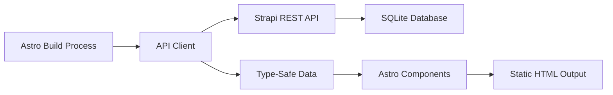

# Design Document

## Overview

This design document specifies the technical implementation for integrating the Astro frontend with the Strapi CMS backend. The integration follows the Zero-Gravity architecture principle: all content is fetched at build time and baked into static HTML, with no runtime API calls. The solution uses TypeScript for type safety, implements efficient caching strategies, and provides comprehensive error handling.

## Architecture

### High-Level Flow



### Build-Time Data Flow

1. Astro build process starts
2. Pages request data through the API Client utility
3. API Client fetches from Strapi REST API with authentication
4. Strapi returns JSON data with populated relations
5. API Client transforms and caches responses
6. Astro components receive type-safe data
7. Static HTML is generated with all content embedded

### Key Architectural Decisions

**Decision 1: Build-Time Only Fetching**
- Rationale: Maintains Zero-Gravity principle (no runtime dependencies)
- Trade-off: Content updates require rebuild/redeploy
- Mitigation: Strapi webhook triggers Cloudflare Pages rebuild

**Decision 2: REST API over GraphQL**
- Rationale: Strapi's REST API is more mature and simpler for this use case
- Trade-off: Less flexible querying, potential over-fetching
- Mitigation: Use populate parameter to control response size

**Decision 3: In-Memory Caching**
- Rationale: Avoid redundant API calls during single build
- Trade-off: Memory usage scales with content size
- Mitigation: Cache only during build, cleared after completion

## Components and Interfaces

### 1. API Client Module (`frontend/src/lib/strapi.ts`)

The central module for all Strapi communication.

**Responsibilities:**
- Construct authenticated API requests
- Handle response parsing and error handling
- Transform Strapi response format to application format
- Provide type-safe data access
- Implement request caching

**Key Functions:**

```typescript
// Fetch all published articles with relations
async function fetchArticles(): Promise<Article[]>

// Fetch single article by slug with full content
async function fetchArticleBySlug(slug: string): Promise<Article | null>

// Fetch all article slugs for static path generation
async function fetchArticleSlugs(): Promise<string[]>

// Fetch homepage content
async function fetchHomePage(): Promise<HomePage>

// Fetch all categories
async function fetchCategories(): Promise<Category[]>

// Helper: Construct full image URL from Strapi media object
function getStrapiMedia(media: StrapiMedia | null): string | null
```

### 2. Type Definitions (`frontend/src/lib/types.ts`)

TypeScript interfaces for all Strapi data structures.

**Core Types:**

```typescript
interface StrapiResponse<T> {
  data: T;
  meta: {
    pagination?: {
      page: number;
      pageSize: number;
      pageCount: number;
      total: number;
    };
  };
}

interface StrapiEntity<T> {
  id: number;
  attributes: T;
}

interface Article {
  id: number;
  title: string;
  description: string;
  slug: string;
  cover: StrapiMedia | null;
  author: Author;
  category: Category;
  blocks: Block[];
  publishedAt: string;
  createdAt: string;
  updatedAt: string;
}

interface Author {
  id: number;
  name: string;
  email: string;
  avatar: StrapiMedia | null;
}

interface Category {
  id: number;
  name: string;
  slug: string;
  description: string | null;
}

interface StrapiMedia {
  id: number;
  name: string;
  alternativeText: string | null;
  caption: string | null;
  width: number;
  height: number;
  formats: {
    thumbnail?: MediaFormat;
    small?: MediaFormat;
    medium?: MediaFormat;
    large?: MediaFormat;
  };
  url: string;
}

interface MediaFormat {
  url: string;
  width: number;
  height: number;
  size: number;
}

type Block = RichTextBlock | MediaBlock | QuoteBlock | SliderBlock;

interface RichTextBlock {
  __component: 'shared.rich-text';
  id: number;
  body: string;
}

interface MediaBlock {
  __component: 'shared.media';
  id: number;
  file: StrapiMedia;
}

interface QuoteBlock {
  __component: 'shared.quote';
  id: number;
  title: string;
  body: string;
}

interface SliderBlock {
  __component: 'shared.slider';
  id: number;
  files: StrapiMedia[];
}

interface HomePage {
  id: number;
  title: string;
  description: string;
  hero: {
    title: string;
    description: string;
  };
}
```

### 3. Environment Configuration

**File: `frontend/.env`**

```
STRAPI_URL=http://localhost:1337
STRAPI_API_TOKEN=your_api_token_here
```

**File: `frontend/.env.example`**

```
STRAPI_URL=http://localhost:1337
STRAPI_API_TOKEN=
```

### 4. Blog Listing Page (`frontend/src/pages/blog.astro`)

**Responsibilities:**
- Fetch all articles at build time
- Render article cards with data from Strapi
- Implement category filtering (client-side)
- Handle empty states

**Data Flow:**
1. Call `fetchArticles()` in frontmatter
2. Call `fetchCategories()` in frontmatter
3. Pass data to template
4. Render cards with article data
5. Generate category filter buttons

### 5. Dynamic Article Page (`frontend/src/pages/blog/[slug].astro`)

**Responsibilities:**
- Generate static paths for all articles
- Fetch individual article content
- Render dynamic zone blocks
- Handle 404 for invalid slugs

**Data Flow:**
1. `getStaticPaths()` calls `fetchArticleSlugs()`
2. For each slug, call `fetchArticleBySlug(slug)`
3. Return paths array with article data as props
4. Render article with block components

### 6. Block Components

**File Structure:**
```
frontend/src/components/blocks/
├── RichTextBlock.astro
├── MediaBlock.astro
├── QuoteBlock.astro
└── SliderBlock.astro
```

Each component receives block data as props and renders appropriately.

### 7. Homepage (`frontend/src/pages/index.astro`)

**Responsibilities:**
- Fetch homepage content
- Fetch featured articles (first 3)
- Render hero section with CMS data

**Data Flow:**
1. Call `fetchHomePage()` in frontmatter
2. Call `fetchArticles()` and slice first 3
3. Render hero with homepage data
4. Render featured article cards

## Data Models

### Strapi Content Types

**Article Schema:**
- title: string
- description: text (max 80 chars)
- slug: uid (auto-generated from title)
- cover: media (single image)
- author: relation (many-to-one with Author)
- category: relation (many-to-one with Category)
- blocks: dynamiczone (rich-text, media, quote, slider)
- publishedAt: datetime (draft/publish system)

**Author Schema:**
- name: string
- email: email
- avatar: media (single image)

**Category Schema:**
- name: string
- slug: uid
- description: text (optional)

**HomePage Schema:**
- title: string
- description: text
- hero: component (title, description)

### API Response Transformation

Strapi returns nested structure:
```json
{
  "data": [
    {
      "id": 1,
      "attributes": {
        "title": "Article Title",
        "author": {
          "data": {
            "id": 1,
            "attributes": { "name": "Author Name" }
          }
        }
      }
    }
  ]
}
```

API Client flattens to:
```typescript
{
  id: 1,
  title: "Article Title",
  author: {
    id: 1,
    name: "Author Name"
  }
}
```

## Implementation Details

### API Client Implementation

**Request Construction:**
```typescript
const STRAPI_URL = import.meta.env.STRAPI_URL;
const STRAPI_TOKEN = import.meta.env.STRAPI_API_TOKEN;

if (!STRAPI_URL) {
  throw new Error('STRAPI_URL environment variable is required');
}

if (!STRAPI_TOKEN) {
  throw new Error('STRAPI_API_TOKEN environment variable is required');
}

async function fetchAPI(endpoint: string, options = {}) {
  const url = `${STRAPI_URL}/api${endpoint}`;
  
  const response = await fetch(url, {
    headers: {
      'Authorization': `Bearer ${STRAPI_TOKEN}`,
      'Content-Type': 'application/json',
    },
    ...options,
  });

  if (!response.ok) {
    throw new Error(`Strapi API error: ${response.status} ${response.statusText}`);
  }

  return response.json();
}
```

**Caching Strategy:**
```typescript
const cache = new Map<string, any>();

async function cachedFetch(key: string, fetcher: () => Promise<any>) {
  if (cache.has(key)) {
    return cache.get(key);
  }
  
  const data = await fetcher();
  cache.set(key, data);
  return data;
}
```

**Article Fetching with Relations:**
```typescript
async function fetchArticles(): Promise<Article[]> {
  return cachedFetch('articles', async () => {
    const response = await fetchAPI(
      '/articles?populate[author][populate]=avatar&populate[category]=*&populate[cover]=*&sort=publishedAt:desc'
    );
    
    return response.data.map(transformArticle);
  });
}
```

**Image URL Construction:**
```typescript
function getStrapiMedia(media: StrapiMedia | null): string | null {
  if (!media) return null;
  
  const url = media.url;
  
  // If URL is relative, prepend Strapi URL
  if (url.startsWith('/')) {
    return `${STRAPI_URL}${url}`;
  }
  
  // If URL is absolute, use as-is
  return url;
}
```

### Error Handling Strategy

**Build-Time Errors:**
- Missing environment variables: Throw immediately with clear message
- API connection failures: Throw with connection details
- Authentication errors: Throw with token validation message
- Missing content: Throw with specific resource details

**Runtime Fallbacks:**
- Missing images: Use placeholder or hide image element
- Empty article list: Display "No articles yet" message
- Missing author/category: Display "Unknown" or hide field

### Category Filtering Implementation

**Approach: Client-Side Filtering**

Rationale: Maintains static output while providing interactivity

Implementation:
1. Render all articles in HTML
2. Add data attributes for category
3. Use Alpine.js or vanilla JS for filtering
4. Show/hide articles based on selected category

```astro
<div x-data="{ activeCategory: 'all' }">
  <button @click="activeCategory = 'all'">All</button>
  <button @click="activeCategory = 'architecture'">Architecture</button>
  
  {articles.map(article => (
    <article 
      x-show="activeCategory === 'all' || activeCategory === '{article.category.slug}'"
      data-category={article.category.slug}
    >
      <!-- Article content -->
    </article>
  ))}
</div>
```

### Dynamic Zone Block Rendering

**Component Mapping:**
```astro
---
import RichTextBlock from '../components/blocks/RichTextBlock.astro';
import MediaBlock from '../components/blocks/MediaBlock.astro';
import QuoteBlock from '../components/blocks/QuoteBlock.astro';
import SliderBlock from '../components/blocks/SliderBlock.astro';

const componentMap = {
  'shared.rich-text': RichTextBlock,
  'shared.media': MediaBlock,
  'shared.quote': QuoteBlock,
  'shared.slider': SliderBlock,
};
---

{article.blocks.map(block => {
  const Component = componentMap[block.__component];
  return <Component {...block} />;
})}
```


## Correctness Properties

A property is a characteristic or behavior that should hold true across all valid executions of a system—essentially, a formal statement about what the system should do. Properties serve as the bridge between human-readable specifications and machine-verifiable correctness guarantees.

### Property 1: URL Construction Correctness

*For any* valid API endpoint string, the API Client should construct a complete URL by correctly combining the STRAPI_URL base with the endpoint path.

**Validates: Requirements 1.5**

### Property 2: Article Relations Population

*For any* fetched article, the author and category relations should be fully populated with their respective data, and if a cover image exists, it should include complete metadata (width, height, formats, url).

**Validates: Requirements 2.2, 2.3**

### Property 3: Article Sorting Order

*For any* list of articles fetched from the API, they should be sorted by publication date in descending order (newest first).

**Validates: Requirements 2.4**

### Property 4: Article Blocks Presence

*For any* article fetched with full content, if the article has blocks defined in Strapi, those blocks should be present in the fetched data.

**Validates: Requirements 2.6**

### Property 5: Article Card Field Rendering

*For any* article rendered as a card on the blog listing page, the rendered HTML should contain the article's title, description, category name, formatted publication date, and author name.

**Validates: Requirements 3.2, 3.3, 3.4, 3.5, 3.6**

### Property 6: Image URL Construction

*For any* image URL from Strapi, if the URL is relative (starts with '/'), it should be converted to an absolute URL by prepending STRAPI_URL; if the URL is already absolute, it should remain unchanged.

**Validates: Requirements 6.1, 6.2**

### Property 7: Image Format Support

*For any* image with multiple format variants (thumbnail, small, medium, large), all format URLs should be accessible and correctly constructed.

**Validates: Requirements 6.3, 6.4**

### Property 8: Static Page Generation

*For any* published article in Strapi, a corresponding static page should be generated at build time with a URL path matching the article's slug.

**Validates: Requirements 4.1, 4.2**

### Property 9: Article Page Data Completeness

*For any* generated article page, the fetched article data should include all blocks from the dynamic zone.

**Validates: Requirements 4.4**

### Property 10: Block Component Mapping

*For any* block in an article's dynamic zone, it should be rendered using the component that corresponds to its __component type identifier.

**Validates: Requirements 4.5**

### Property 11: Homepage Hero Display

*For any* homepage content fetched from Strapi, if the hero section has a title and description, both should be displayed in the rendered HTML.

**Validates: Requirements 5.3, 5.4**

### Property 12: Featured Articles Limit

*For any* fetch of featured articles for the homepage, the result should contain at most 3 articles.

**Validates: Requirements 5.5**

### Property 13: API Response Caching

*For any* API endpoint requested multiple times during a single build process, subsequent requests should return cached data without making additional HTTP calls.

**Validates: Requirements 9.1, 9.4**

### Property 14: Parallel Request Execution

*For any* set of independent API requests (e.g., fetching articles and categories), the requests should execute in parallel rather than sequentially.

**Validates: Requirements 9.2**

### Property 15: Category Filter Rendering

*For any* set of categories fetched from Strapi, a corresponding filter button should be rendered for each category on the blog listing page.

**Validates: Requirements 10.1**

### Property 16: Category Filter Functionality

*For any* category filter activated on the blog listing page, only articles belonging to that category should be visible in the rendered output.

**Validates: Requirements 10.2**

### Property 17: Active Filter Indication

*For any* active category filter, the corresponding filter button should have distinct visual styling to indicate its active state.

**Validates: Requirements 10.5**

## Error Handling

### Build-Time Error Strategy

The integration follows a "fail-fast" approach for build-time errors to ensure issues are caught before deployment.

**Error Categories:**

1. **Configuration Errors**
   - Missing STRAPI_URL: Throw with message "STRAPI_URL environment variable is required"
   - Missing STRAPI_API_TOKEN: Throw with message "STRAPI_API_TOKEN environment variable is required"
   - Invalid URL format: Throw with message "STRAPI_URL must be a valid URL"

2. **Connection Errors**
   - API unreachable: Throw with message "Failed to connect to Strapi at {url}: {error}"
   - Timeout: Throw with message "Strapi API request timed out after {timeout}ms"

3. **Authentication Errors**
   - 401 Unauthorized: Throw with message "Invalid Strapi API token. Check STRAPI_API_TOKEN"
   - 403 Forbidden: Throw with message "Strapi API token lacks required permissions"

4. **Data Errors**
   - 404 Not Found: Throw with message "Strapi content type not found: {endpoint}"
   - Malformed JSON: Throw with message "Invalid JSON response from Strapi: {details}"
   - Missing required fields: Throw with message "Article missing required field: {field}"

5. **Empty Data Handling**
   - Empty articles array: Display "No articles published yet" message
   - Missing author/category: Display "Unknown" or hide field
   - Missing cover image: Use placeholder or hide image element

### Error Logging

All errors should include:
- Timestamp
- Error type/category
- Detailed message
- Request URL (if applicable)
- Stack trace (for debugging)

### Graceful Degradation

For non-critical failures:
- Missing images: Show placeholder or hide
- Missing optional fields: Hide or show default
- Empty lists: Show appropriate empty state message

## Testing Strategy

### Dual Testing Approach

The integration will use both unit tests and property-based tests to ensure comprehensive coverage:

**Unit Tests:**
- Specific examples of API responses and transformations
- Edge cases (empty arrays, null values, missing fields)
- Error conditions (network failures, auth errors, malformed data)
- Integration points between components

**Property-Based Tests:**
- Universal properties that hold for all inputs
- Comprehensive input coverage through randomization
- Validation of correctness properties defined above

### Property-Based Testing Configuration

**Library:** fast-check (JavaScript/TypeScript property-based testing library)

**Configuration:**
- Minimum 100 iterations per property test
- Each test tagged with feature name and property number
- Tag format: `Feature: astro-strapi-integration, Property {N}: {property_text}`

**Example Property Test Structure:**

```typescript
import fc from 'fast-check';
import { describe, it, expect } from 'vitest';

describe('Feature: astro-strapi-integration', () => {
  it('Property 3: Article Sorting Order', () => {
    // Feature: astro-strapi-integration, Property 3: Article Sorting Order
    fc.assert(
      fc.property(
        fc.array(articleArbitrary, { minLength: 2 }),
        (articles) => {
          const sorted = sortArticlesByDate(articles);
          
          for (let i = 0; i < sorted.length - 1; i++) {
            const current = new Date(sorted[i].publishedAt);
            const next = new Date(sorted[i + 1].publishedAt);
            expect(current.getTime()).toBeGreaterThanOrEqual(next.getTime());
          }
        }
      ),
      { numRuns: 100 }
    );
  });
});
```

### Unit Test Coverage

**API Client Tests:**
- URL construction with various endpoints
- Response transformation from Strapi format
- Error handling for each error category
- Caching behavior
- Image URL construction

**Component Tests:**
- Article card rendering with complete data
- Article card rendering with missing optional fields
- Block component rendering for each type
- Category filter interaction
- Empty state rendering

**Integration Tests:**
- Full build process with mock Strapi API
- Static path generation
- Data flow from API to rendered HTML

### Test Data Strategy

**Mock Data:**
- Create realistic mock Strapi responses
- Include edge cases (null values, empty arrays)
- Test with various content structures

**Generators for Property Tests:**
- Article generator with random but valid data
- Author generator
- Category generator
- Block generator for each type
- Date generator for sorting tests

### Testing Tools

- **Test Runner:** Vitest
- **Property Testing:** fast-check
- **Mocking:** Vitest mocks for fetch API
- **Assertions:** Vitest expect API

### Test Organization

```
frontend/src/
├── lib/
│   ├── strapi.ts
│   ├── strapi.test.ts          # Unit tests for API client
│   ├── strapi.property.test.ts # Property tests for API client
│   ├── types.ts
│   └── test-utils.ts           # Shared test utilities and generators
├── components/
│   └── blocks/
│       ├── RichTextBlock.astro
│       ├── RichTextBlock.test.ts
│       └── ...
└── pages/
    └── blog/
        ├── [slug].astro
        └── [slug].test.ts
```

### Continuous Integration

Tests should run:
- On every commit (pre-commit hook)
- On pull requests (CI pipeline)
- Before deployment (build pipeline)

Build should fail if:
- Any test fails
- Coverage drops below threshold (80%)
- Property tests find counterexamples
